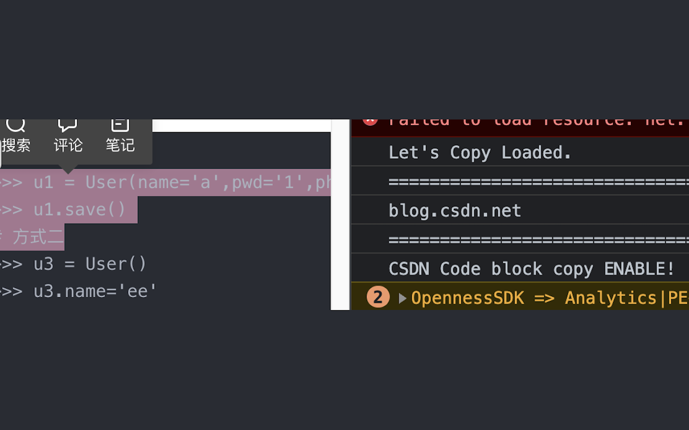

# Let's Copy

A Chrome extension that unlocks **copy**, **text selection**, and **right-click** on websites that disable them.



## Features

- 🔓 **Unlocks text selection** — overrides `user-select: none` and friends
- 📋 **Re-enables copy / cut / paste** — strips inline handlers and swallows `copy`/`cut`/`paste` blockers
- 🖱️ **Re-enables right-click** — installs capture-phase listeners *before* the page's own `contextmenu` handlers register, which is the only reliable way to defeat `addEventListener('contextmenu', ...)` locking
- ⚡ **Always-on mode** — auto-unlock every site you visit
- 🎯 **Per-site toggle** — remembered across sessions
- ⌨️ **Keyboard shortcut** — `Alt+Shift+C` to toggle the current site
- 🌓 **Dark mode** — the popup follows your system theme

## How it works

When a site is enabled, the extension registers a dynamic content script that runs at `document_start` in the page's MAIN world. This means our capture-phase listeners for `contextmenu`, `selectstart`, `copy`, `cut`, `paste`, and `dragstart` are installed *before* any of the page's own scripts can register theirs — so the page's blockers never see those events.

The extension also:
- Strips inline event attributes (`oncontextmenu`, `oncopy`, `unselectable`, …) on all existing and future elements via a `MutationObserver`
- Injects a high-specificity stylesheet that overrides `user-select: none` everywhere
- Handles CSDN's code-block trick via `document.designMode = 'on'`

## Install

1. `bash package.sh` (or zip the `src/` folder yourself)
2. Open `chrome://extensions/`
3. Enable **Developer mode**
4. Drag the zip in, or click **Load unpacked** and select `src/`

## Project layout

```
src/
├── manifest.json       MV3 manifest
├── background.js       Service worker — state, icon, injection
├── enable.js           Page-side unlock (MAIN world, document_start)
├── popup.html          Popup UI
├── popup.css           Popup styles (light/dark)
├── popup.js            Popup logic
└── icons/              Toolbar & store icons
```

## Icon credits

- Enable: <https://www.flaticon.com/free-icon/check_9902393?related_id=9902393&origin=pack>
- Disable: <https://www.flaticon.com/free-icon/copy_9902369?term=copy&page=1&position=13&origin=search&related_id=9902369>
